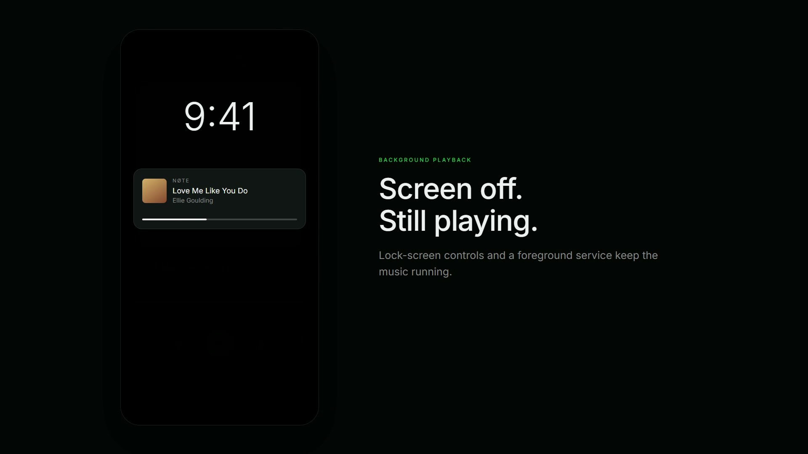

<div align="center">

# NØTE

**A music player for Android. Search, queue, and play — with the screen off.**

No account. No ads. No backend. No tracking.

[](LICENSE)
[](#download)
[](https://github.com/SJbuilds04/NOTE/releases/latest)

</div>

---

<div align="center">

<a href="https://github.com/SJbuilds04/NOTE/releases/latest">
  
</a>

<!-- To replace this still with the inline showcase video:
     1. Open any GitHub issue or comment box on this repo
     2. Drag brag.mp4 into it -- GitHub uploads it and gives you a URL like
        https://github.com/user-attachments/assets/<uuid>
     3. Delete the <a>...</a> block above and paste that bare URL on its own
        line here. GitHub renders it as an inline video player.
     Do NOT commit the mp4 itself -- it bundles a third-party music track. -->

</div>

---

## What it is

NØTE is a free, open-source music player. You search for a song, tap it, and it plays —
including in the background, with the screen locked, using your phone's normal lock-screen
media controls.

Everything you build up — liked songs, playlists, history, queue — is stored **on your
device only**. There is no NØTE account, no NØTE server, and nothing is sent anywhere
except the requests needed to search for and stream the audio you asked for.

## Features

- **Search** — songs, artists, albums and playlists, with artwork and durations
- **Background playback** — keeps playing with the screen off, via a foreground service
- **Lock-screen controls** — play/pause, skip, and ±10s seeking from the notification
- **Queue** — add, remove, reorder, play-next, shuffle, and repeat (off / all / one)
- **Library** — liked songs, your own playlists, and imported public playlists
- **History** — what you played, when
- **Resumes where you left off** — queue and playback position survive a restart
- **A real seek bar** — drag to scrub, not a decoration

## Download

Grab the signed APK from the **[latest release](https://github.com/SJbuilds04/NOTE/releases/latest)**:

**[⬇ Download NOTE-v1.0.0.apk](https://github.com/SJbuilds04/NOTE/releases/latest/download/NOTE-v1.0.0.apk)**

Verify it before installing:

```
SHA-256  ca911b5a49ead0f3129a1748a575fb8c5b746ccd6ed035c42441283ac536ee52
```

```bash
# Linux / macOS
sha256sum NOTE-v1.0.0.apk

# Windows (PowerShell)
Get-FileHash NOTE-v1.0.0.apk -Algorithm SHA256
```

NØTE is **not distributed through Google Play**, so you install it by sideloading. Android
will warn you about installing from an unknown source — that warning is expected for any
APK obtained outside the Play Store. Only install a build whose checksum matches the one
published above, or one you compiled yourself from this repository.

Requires Android 7.0 or newer. The release APK is signed with the project's own key; it is
not affiliated with, reviewed by, or distributed by Google.

## Build from source

You do not have to trust the published APK — you can build your own.

**Prerequisites**

- Node.js 20+
- JDK 17 or newer (Android Studio's bundled JBR works)
- Android SDK with platform-tools, and `ANDROID_HOME` set

**Steps**

```bash
git clone https://github.com/SJbuilds04/NOTE.git
cd NOTE
npm install

# Generate the native Android project (android/ is not committed)
npx expo prebuild --platform android

# Build and install a debug build on a connected device
npm run android
```

To produce a release build, supply your own signing key and run the Gradle release task.
The keystore used for the published APK is **not** in this repository and never will be.

> **Note:** `android/` is generated by `expo prebuild` and is intentionally gitignored, so a
> clean checkout will not contain it. Re-run prebuild after pulling changes that touch native
> configuration.

## How it works

```
UI  →  MusicService  →  ProviderAdapter  →  TrackResolver  →  PlaybackEngine
```

The layers are deliberately separated so that no screen contains provider-specific logic.
Stream resolution sits behind a small plugin interface:

```
streamResolver = DirectStreamSource → NativeStreamSource → EndpointStreamSource
```

`NativeStreamSource` is an Android-only Kotlin module that resolves a progressive audio
stream. `EndpointStreamSource` lets you point the app at a compatible service you run or are
authorised to use. Adding another source means writing one class that implements three
methods — nothing else in the app changes.

---

# Legal

Please read this section before using, building, or redistributing NØTE.

## License

**NØTE is licensed under the GNU General Public License, version 3 or (at your option) any
later version (GPL-3.0-or-later).** The full license text is in [`LICENSE`](LICENSE); the
project copyright notice is in [`COPYRIGHT`](COPYRIGHT).

```
NØTE — a music player for Android
Copyright (C) 2026 Sanyam Jain

This program is free software: you can redistribute it and/or modify it under the
terms of the GNU General Public License as published by the Free Software Foundation,
either version 3 of the License, or (at your option) any later version.
```

### Why GPL and not a permissive license

NØTE links the **NewPipe Extractor**, which is GPL-3.0-or-later. GPL is a copyleft
license, so any distributed work that combines with it must be released under the same
terms. NØTE is therefore GPL-3.0-or-later. This is not optional and not a preference — it
is the licensing consequence of the dependency.

An earlier revision of this repository carried an MIT `LICENSE` inherited from the Expo
project template. That text did not describe the combined work and has been replaced.

### What the license means for you

You may **use, study, modify, and redistribute** NØTE, including commercially. In exchange,
if you distribute NØTE or any derivative of it — modified or not, as source or as an APK —
you must:

1. License the whole work under GPL-3.0-or-later,
2. Provide or offer the **complete corresponding source code**, including your changes, and
3. Preserve the copyright notices and this license information.

You may **not** relicense NØTE or any derivative under a permissive or proprietary license,
and you may not distribute a binary without making the matching source available.

### Source code availability

This repository **is** the complete corresponding source for the released APK, as required
by GPL-3.0-or-later §3 and §6. If you received a NØTE binary from anywhere else and cannot
obtain its source, that redistribution is not compliant with the license.

## Warranty disclaimer

As stated in sections 15 and 16 of the GPL:

> This program is distributed in the hope that it will be useful, but **WITHOUT ANY
> WARRANTY**; without even the implied warranty of **MERCHANTABILITY** or **FITNESS FOR A
> PARTICULAR PURPOSE**. See the GNU General Public License for more details.

You use NØTE entirely at your own risk. The author accepts no liability for any damages
arising from its use.

## Third-party components

Full notices, versions, and license terms are in
**[`THIRD_PARTY_NOTICES.md`](THIRD_PARTY_NOTICES.md)**. Summary:

| Component | License | How it is used |
|---|---|---|
| [NewPipe Extractor](https://github.com/TeamNewPipe/NewPipeExtractor) `v0.26.5` | GPL-3.0-or-later | Unmodified binary dependency via JitPack |
| nanojson, jsoup | MIT | Transitive, via NewPipe Extractor |
| Mozilla Rhino | MPL-2.0 | Transitive, via NewPipe Extractor |
| Expo, React Native and their ecosystem | MIT | Application framework |

No NewPipe source code has been copied into this repository, and none has been modified.
The NewPipe **application** is not used or bundled — only the extractor library.

## No affiliation or endorsement

- NØTE is **not affiliated with, authorised by, endorsed by, or sponsored by Google LLC,
  YouTube, or any of their subsidiaries.** "YouTube" and "Google" are trademarks of
  Google LLC. They are referred to here only to describe what the software does
  (nominative use); no claim is made to those marks.
- NØTE is **not affiliated with Team NewPipe.** NewPipe Extractor is used as an
  independent, unmodified library under its own license, and its authors have no
  involvement in this project.
- NØTE is an independent project by Sanyam Jain.

## No content is hosted or distributed

**NØTE does not host, store, upload, cache for redistribution, or provide any music, audio,
video, or other copyrighted content.** It contains no media library of its own.

NØTE is a client. It performs the same kind of requests a browser performs, on your device,
at your direction, and plays the result back to you. All content remains with its original
host and its rights holders. No content passes through any infrastructure operated by the
author.

## Your responsibility as a user

Accessing a third-party service through an unofficial client **may conflict with that
service's terms of service**, and those terms are a matter between you and that service.

By using NØTE you accept that:

- You are solely responsible for how you use it, and for complying with the terms of
  service of any platform you access through it, as well as with the copyright law and any
  other laws that apply where you live.
- The author does not encourage or condone copyright infringement.
- NØTE is published as **free software for personal, educational, and interoperability
  purposes**, and is provided as-is with no warranty of any kind.

If you are unsure whether your intended use is lawful in your jurisdiction, seek your own
legal advice. Nothing in this document is legal advice.

## Privacy

NØTE has no account system, no analytics, no telemetry, no crash reporting, and no server
operated by the author.

Liked songs, playlists, history, queue, playback position, and settings are written to your
device's local storage and never leave it. Uninstalling the app removes them. The only
network requests NØTE makes are those required to fulfil a search or play a track you
selected.

## DMCA and contact

If you believe something in **this repository** infringes your rights, please open an issue
or contact the maintainer through GitHub so it can be addressed promptly. Note that this
repository contains source code only — takedown requests concerning media content should be
directed to the platform actually hosting that content, not here.

---

## Contributing

Contributions are welcome. By submitting a pull request you agree that your contribution is
licensed under **GPL-3.0-or-later**, consistent with the rest of the project.

Please keep the existing architecture boundaries intact — in particular, screens should not
contain provider-specific playback logic.

## Credits

Built by **[Sanyam Jain](https://github.com/SJbuilds04)** (SJBUILDS).

Stream resolution is powered by the excellent
[NewPipe Extractor](https://github.com/TeamNewPipe/NewPipeExtractor) by Team NewPipe.

<div align="center">

**LISTEN FREELY. LIVE FULLY.**

</div>
